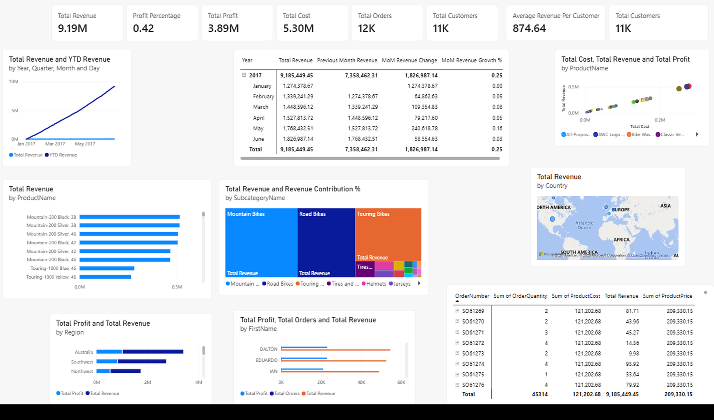

# 📊 Power BI Sales Analytics – Capstone Project

## 📌 Project Overview
This Power BI Capstone Project focuses on analyzing sales and business performance through an interactive Business Intelligence dashboard.

The dashboard provides insights into revenue, profit, cost, orders, customers, product performance, regional performance, and sales trends.

## 📊 Dashboard Preview

## 🎯 Key Metrics
- Total Revenue
- Total Profit
- Total Cost
- Profit Percentage
- Total Orders
- Total Customers
- Average Revenue per Customer

## 📈 Analysis Performed
The dashboard includes analysis of:

- Revenue trends over time
- Year-to-Date (YTD) Revenue
- Previous Month Revenue
- Month-over-Month Revenue Growth
- Product-wise Revenue and Profit
- Subcategory Revenue Contribution
- Regional Performance
- Country-wise Sales Performance
- Customer and Order Analysis

## 🧮 DAX Measures
DAX measures were used to calculate and analyze:

- Total Revenue
- Total Cost
- Total Profit
- Profit Percentage
- Total Orders
- Total Customers
- YTD Revenue
- Previous Month Revenue
- Month-over-Month Revenue Change
- Month-over-Month Revenue Growth

## 🛠 Tools & Skills
- Microsoft Power BI
- DAX
- Data Analysis
- Data Visualization
- Business Intelligence
- Data Modeling
- Dashboard Development

## 📁 Project Files
- `PowerBI Capstone Project.pbix` – Complete Power BI project
- `PowerBI_Dashboard.png` – Dashboard preview

## 👤 Author
**Indhuraj L**

Data Science & Analytics
